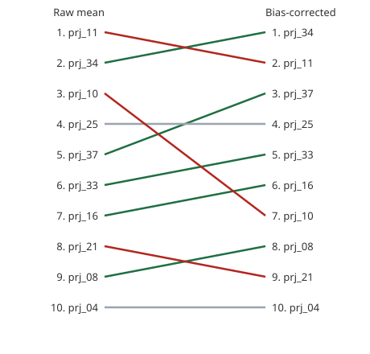
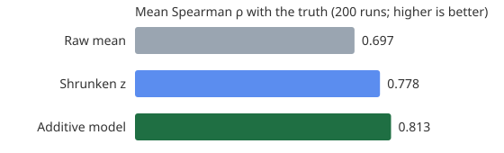

# Judging: assignment, scoring and normalization

This document explains, and defends, every number Raptor Desk produces between a
judge scoring a project and a ranking being published. Every figure below is
reproduced by one command:

```
uv run python tools/simulate_proof.py
```

The code lives in `src/scoring_engine/`, a pure Python package with no Django
and no database (an import-linter contract enforces this), so it can be read
and tested on its own.

---

## 1. From a review to one number

A rubric has criteria with weights, either percentages that sum to 100 or
relative multipliers. A review's **composite** is the weighted mean of its
scored criteria, on the rubric's own scale:

    composite = Σ w_c · x_c / Σ w_c      (scored criteria present in the review)

- **Gate criteria** (for DOGFOOD, "T1 cleared") never enter the composite. A
  project whose average gate score is below the threshold is not ranked at all.
- **Bonus criteria** (for DOGFOOD, the four bonus challenges) never change a
  score. They only break exact ties.
- **A missing criterion is left out**, not counted as zero.

Each judge contributes **one observation per project**: their latest submitted
review. A resubmitted project is one project with two versions (see §4), and
a judge who reviewed both counts once, with the version they saw last.

---

## 2. Assignment strategy

`scoring_engine/assignment.py` plans who reviews what.

**Hard constraints, never broken:**
- a judge only reviews projects in tracks they cover (a judge with no track covers all)
- never a project from a team they have a conflict with. Conflicts are declared, or come from team membership or listed emails; domain matching is opt-in, because every fixture email is `@example.org`
- never the same project twice
- never more than the event's maximum load

**Preferences, in order:**
1. projects with the fewest eligible judges are placed first, so specialists are not used up by easy projects
2. the least-loaded eligible judge
3. the judge who has shared the fewest projects with this project's other judges. This keeps the judge network connected, which the bias model in §5 needs
4. a stable hash of (judge, project) breaks remaining ties, so **the same input always produces the same plan**

Reviews that cannot be placed are reported as shortfalls, never silently dropped.
A plan is a **proposal** until an organizer publishes it. Each judge's queue is
drawn in a random order (stored), so the position a project appears in does not
systematically help or hurt it.

---

## 3. Who can see what

Isolation is enforced by the API, not the pages:
- a judge reads only their own reviews
- another judge's scores return **403** before anything is looked up
- aggregates (results, rankings, judge diagnostics) and the audit trail are for the event's organizers only
- review data is read through a repository layer that scopes every query to the caller
- after publishing:
  - everyone can read the published ranking and the signed snapshot
  - each team can read its own feedback report, where judges are never named
  - individual judges' scores stay closed

The official acceptance checker verifies this (`acceptance-report.txt`).

---

## 4. The awkward cases in the fixtures

| Case | Where | What Raptor Desk does |
|---|---|---|
| **The judge who marks everything the same** | `jdg_07` gave 4/4/4 to all three of their projects | Recognised because the per-criterion scores are identical, not just the totals. Their reviews carry no ranking signal and are left out of the fit. They are listed in the diagnostics and in the boot report |
| Equal totals that are not rubber-stamping | `jdg_19`'s composites happen to be equal after the resubmission merge (5+4+2 and 4+3+4 both total 11) | **Not** treated as flat: these are genuine judgements that happen to tie |
| Judges with one review | `jdg_01`, `jdg_23` | Kept, but their leniency is heavily shrunk (ridge, §5). Flagged "fewer than 3 reviews" |
| Resubmission | `prj_07` and `prj_41`, "Dry Harbour", same team and repo, 3 minutes before the close | One project with two versions. The later version is canonical. Each judge counts once, with the latest version they reviewed |
| Unfinished batches | 8 projects have 2 reviews instead of 3 | Reported as under-reviewed. Wider intervals follow automatically |
| Weak evidence | `prj_19`: 2 reviews, one from the flat-liner | Flagged "fewer than 2 informative reviews" |
| Missing feedback | 49 of 123 counted reviews have no comment | Reported. New reviews cannot be submitted without written feedback |
| Shared team names | "StillTrail" is used by three different teams | Each team keeps its id and gets a unique display name |

---

## 5. Estimators

All three are always computed and shown side by side. The organizer chooses
which one ranks; the default is the additive model.

### Raw mean
The average of the observations. It rewards a project for drawing lenient judges.

### Why not the textbook z-score
`z = (s − mean_j) / sd_j` divides by the judge's spread. On the fixtures that
is zero or undefined for the flat-liner, the two single-review judges and
`jdg_19`. **7 projects get a NaN score** (prj_03, prj_07, prj_08, prj_09,
prj_17, prj_19, prj_24). Several platforms advertise z-score normalization;
on this data it breaks.

### Shrunken z-score (empirical Bayes)
Each judge's mean and spread are shrunk toward the panel's, with a strength of
k pseudo-reviews (k = 3):

    mu_j'    = (n_j · mu_j + k · mu_g) / (n_j + k)
    sigma_j' = sqrt((n_j · sigma_j² + k · sigma_g²) / (n_j + k))
    s'       = mu_g + sigma_g · (s − mu_j') / sigma_j'

A judge with one review or no spread borrows the panel's spread, so nothing is
ever divided by zero, and results stay on the rubric's scale.

### Additive judge-severity model (default)
Each score is modelled as the project's quality plus the judge's leniency plus noise:

    s_jp = q_p + b_j + e

It is fitted by ridge-regularised alternating least squares (λ = 1):

    q_p = (Σ_j (s_jp − b_j) + λ · mu) / (n_p + λ)
    b_j =  Σ_p (s_jp − q_p)           / (n_j + λ)

- `b_j` is the judge's leniency: positive is generous, negative is harsh.
- It never divides by a judge's spread.
- The ridge term pulls the leniency of judges with few reviews toward zero, and the quality of thinly reviewed projects toward the mean. That is the honest amount of doubt.
- The model is identifiable because judges overlap on projects. The fixture's judge–project graph is one connected component, and the assignment planner keeps it connected.

---

## 6. Uncertainty and decision flags

The chosen estimator is refitted on 300 bootstrap resamples (reviews resampled
within each project, fixed seed). For each project this gives:
- a **90% interval**: the 5th to 95th percentile of its score
- **P(top k)**: how often it finished inside each prize cutoff (1, 2, 3, 5)

Flags:
- **close call for top k**: 0.2 < P(top k) < 0.8. The data does not settle it.
- **fewer than 2 informative reviews**: the rank rests on too little evidence.
- **methods disagree on the top k**: the shrunken z and additive top-k sets differ. A human should decide, with the reasons recorded.

A model never silently decides prize money.

### Measure, Doubt, Ask

Averaging after the fact cannot fix a ranking that lacks evidence. Raptor Desk
uses the doubt to decide where the next judge-hours go:

1. **Measure.** The rubric and the additive model give a corrected score per project.
2. **Doubt.** The bootstrap gives each project's chance of finishing inside every prize cutoff. Chances between 0.2 and 0.8 are close calls.
3. **Ask.** Within a budget the organizer sets, the desk proposes extra reviews of exactly those projects, most uncertain first (`scoring_engine/ask.py`).
   - **Hard constraints:** the judge covers the track, has no conflict, has not reviewed the project, is under the load cap, and is not a flat-liner.
   - **Preferences, in order:** judges who already reviewed the neighbouring close calls (their direct comparison is what separates neighbours), then the least-loaded judge, then the judge with the most reviews (best-measured leniency).
   - One click turns the proposals into assignments, emails the judges and writes the audit trail.
   - Projects waiting for asked reviews are not asked about again.
   - Projects with no eligible judge left are named for deliberation.

On the fixtures, the Developer tools and Open hardware tracks have only three
judges each, and all three already reviewed their close calls (prj_34, prj_11,
prj_33). The desk says so, rather than breaking the track rule.

`manage.py demo_loop` (demo profile only) runs one round on the fixtures. It
enters synthetic reviews at the panel's consensus, labelled `[demo]` in the
review and in the audit trail. The chances then move away from a coin flip:

| Project | Cutoff | Before | After 6 asked reviews |
|---|---|---|---|
| prj_25 | top 5 | 50% | 71% |
| prj_37 | top 5 | 58% | 69% |
| prj_16 | top 5 | 36% | 25% |
| prj_18 | top 5 | 22% | 13% (settled) |

Two reviews rarely settle a call on their own. The loop is meant to be run
again as reviews arrive, and whatever is still close goes to deliberation.

---

## 6b. From ranking to published result

1. **Deliberate.**
   - The Deliberation tab shows the computed order and the close calls on the prize places nobody has ruled on yet.
   - An organizer records decisions, each with a written reason:
     - "confirm at the computed place"
     - "place directly above"
   - Decisions are append-only and applied in order.
   - DOGFOOD's own tie rule is applied automatically: an exact tie on the corrected score is broken by bonus points, and the board says where that happened.
2. **Freeze.** The final order is frozen into a numbered snapshot, signed with the deployment's Ed25519 key. It contains:
   - every project's corrected score, interval and chances
   - the decisions and their reasons
   - the method and parameters
   - a hash over every review score that went in

   The snapshot table is append-only. A snapshot stays *current* until a score or a decision changes.
3. **Publish.** Publishing is the phase change to *published*, and preflight blocks it when:
   - nothing is frozen
   - the latest snapshot is out of date
   - a close call on the prize places has no decision

   An override needs a written reason, and even then a signed snapshot is what gets published.
4. **Explain.**
   - The public results page shows the prize places, the full ranking with intervals, the decisions with their reasons, and a method card with the snapshot hash and signing key.
   - The signed document is at `/api/events/{id}/results/published`.
   - Every team is emailed a link to its feedback report:
     - its place, and the judges' average per criterion against the event average
     - every written comment and "one thing to improve", unattributed and in a fixed shuffled order
   - A team can query a factual error. Organizers answer, and both steps are audited. The signed result itself never changes.

### 6c. Pairwise mode (Bradley–Terry)

Some judges find a 1 to 5 scale hard to hold steady across twenty projects, but
can say reliably which of two projects is stronger. Pairwise mode asks exactly
that.

- **Who compares what.** A judge compares two projects they were assigned, so they have seen both, and conflicts are already excluded. Each judge answers each pair once: "A is stronger", "B is stronger" or "too close to call", with the arrow keys.
- **Which pair comes next.** The most informative pair left. Pairs involving a close call on the prize places come first, then the pair whose outcome the current model predicts least well.
- **The model.** Bradley–Terry, P(i beats j) = s_i / (s_i + s_j), fitted with Hunter's MM algorithm, which raises the likelihood at every step. A tie counts as half a win for each side. A weak prior (one virtual win and one virtual loss against an average project) keeps every strength finite, even for a project that never lost, and pulls thinly compared projects towards the middle.
- **Uncertainty.** A seeded bootstrap over the comparisons gives a 90% interval on each log-strength, and each project's chance of finishing inside every cutoff, the same as for the scores.
- **Where it shows.** A separate table on the organizer's results page, with the Spearman agreement with the score-based ranking on the same projects. It never replaces the scores: where the two disagree, the organizer sees it in deliberation.
- **Integrity.** Comparisons are append-only and go into the event's signed score ledger. Only the judge and the organizers can see them. The API is `/api/events/{id}/pairwise/next`, `/pairwise` and `/pairwise/standings`.
- **Tests** (`tests/scoring/test_pairwise.py`): the estimator recovers a known order from simulated comparisons (Spearman above 0.85 for 20 projects and 600 comparisons), matches the closed-form odds for two projects, keeps unbeaten and uncompared projects finite, and is reproducible whatever order the comparisons arrive in.

### Tamper evidence and signed records

- **Score ledger.** Every submitted, amended or imported review appends a ledger entry:
  - the scores, and a SHA-256 of the written feedback
  - a hash chained to the previous entry
  - an Ed25519 signature with the deployment key

  The table is append-only. Verification recomputes every hash and signature, then checks that the live scores and feedback still match the latest entry for each review. A direct database edit is therefore found and located by sequence number. `manage.py demo_tamper` shows this.
- **Judge protocols.** When judging closes, every judge gets a signed, numbered protocol of every score they gave, each tied to its ledger entry. It is private to that judge and the organizers.
- **Certificates and participation records.** When results are published, judges get certificates and team members get participation records.
  - They are signed and contain no scores or places.
  - They are public only to whoever holds their random code.
  - A judge can opt in to a public passport that lists their certificates across events.
- **Checking.**
  - Anything signed can be checked at `/verify`, or offline with `python3 tools/verify.py file.json --portal <url>`.
  - The tool uses only the standard library, with an RFC 8032 Ed25519 implementation.
  - A document re-signed with any key other than the portal's is rejected.

---

## 7. Results on the official fixtures

<!-- generated:fixture-results -->
- Observations (latest review per judge and project): 123
- Judges with identical scores on every criterion: jdg_07
- Projects where the textbook z-score is NaN: 7 (prj_03, prj_07, prj_08, prj_09, prj_17, prj_19, prj_24)
- Flags on the ranking: **methods disagree on the top 3**

| Rank | Project | Raw mean (rank) | Shrunken z | Additive | Move | 90% interval | P(top 5) |
|---|---|---|---|---|---|---|---|
| 1 | prj_34 | 4.333 (2) | 4.328 | 4.102 | ▲1 | 3.91–4.30 | 0.90 |
| 2 | prj_11 | 4.333 (1) | 4.176 | 4.054 | ▼1 | 3.91–4.17 | 0.88 |
| 3 | prj_37 | 4.083 (5) | 4.069 | 3.995 | ▲2 | 3.53–4.41 | 0.58 |
| 4 | prj_25 | 4.111 (4) | 4.017 | 3.948 | – | 3.62–4.22 | 0.50 |
| 5 | prj_33 | 4.000 (6) | 4.163 | 3.928 | ▲1 | 3.78–4.03 | 0.38 |
| 6 | prj_16 | 4.000 (7) | 3.934 | 3.914 | ▲1 | 3.58–4.18 | 0.36 |
| 7 | prj_10 | 4.167 (3) | 3.999 | 3.819 | ▼4 | 3.55–4.12 | 0.21 |
| 8 | prj_08 | 3.800 (9) | 3.687 | 3.755 | ▲1 | 3.27–4.14 | 0.19 |
| 9 | prj_21 | 3.889 (8) | 3.744 | 3.719 | ▼1 | 3.24–4.15 | 0.20 |
| 10 | prj_04 | 3.778 (10) | 3.708 | 3.702 | – | 3.39–3.98 | 0.12 |
<!-- /generated:fixture-results -->



**What this shows:**
1. **The raw average ties for first place.** prj_11 and prj_34 both score 4.333. Both corrections resolve the tie in favour of prj_34.
2. **prj_10 is third on the raw average only because of who judged it.** It has two reviews, one of them from `jdg_15`, the second most lenient judge (+0.44). Corrected, it drops to 6th (shrunken z) or 7th (additive), outside the top five. Prize money would change hands on judge luck.
3. **Only first and second are statistically solid.** Places 3 to 5 are close calls (their chance of a top-5 finish in the table is between 0.2 and 0.8), and the two corrections disagree on third. The honest output is "these need more evidence or a human decision", not a confident rank.
4. **Leniency is large compared with the gaps between projects.** Judges range from −0.82 (`jdg_01`, one review) to +0.52 (`jdg_02`). The gaps between neighbouring projects are 0.02 to 0.10.

---

## 8. Proof: recovering a known truth

The fixture has no ground truth, so `scoring_engine/simulate.py` builds events
that do:
- 40 projects with a true quality
- 30 judges with leniency ~ N(0, 0.7) and noise
- 3 reviews per project, with 15% of reviews missing
- one flat-lining judge

Each method is then scored on how well it recovers the true order.

<!-- generated:simulation -->
| Method | Mean Spearman ρ with the truth (200 runs) | Top-5 recall | Runs where it beats raw |
|---|---|---|---|
| raw mean | 0.697 (sd 0.094) | 0.502 | – |
| shrunken z | 0.778 (sd 0.076) | 0.562 | 96% |
| **additive** | **0.813** (sd 0.064) | **0.604** | **96%** |
<!-- /generated:simulation -->



The same comparison runs in the test suite on every commit
(`tests/scoring/test_normalization.py`), together with property tests. No input,
including one judge with one review, identical scores or an empty event, can
produce NaN or infinity.

### 8b. Calibration: is the stated uncertainty honest?

A 90% interval should contain the truth about 90% of the time, and a project
given a 70% chance of a top-5 finish should finish there about 70% of the time.
`scoring_engine/calibration.py` checks both on the same 200 synthetic events,
with the production bootstrap (300 resamples). The model fixes quality only up
to a shift, so each event's estimates are moved to the truth's mean first.
We publish the numbers as they come out:

<!-- generated:calibration -->
- Projects checked: 7973 across 200 synthetic events
- **90% intervals that contain the true quality: 52%** (22% with 1 informative review, 48% with 2 informative reviews, 59% with 3+ informative reviews)
- Brier score of P(top 5): **0.073**, against 0.109 for always stating the base rate (lower is better)
- Projects ranked on the wrong side of the top-5 line: 785; flagged as a close call beforehand: **396 (50%)**

| Stated P(top 5) | Projects | Mean stated | Really in the top 5 |
|---|---|---|---|
| 0.00–0.05 | 5722 | 0.00 | 0.03 |
| 0.05–0.20 | 744 | 0.11 | 0.15 |
| 0.20–0.50 | 626 | 0.32 | 0.26 |
| 0.50–0.80 | 427 | 0.64 | 0.50 |
| 0.80–0.95 | 238 | 0.89 | 0.71 |
| 0.95–1.00 | 216 | 0.98 | 0.80 |
<!-- /generated:calibration -->

**What this means:**
1. **The intervals are too narrow.** Resampling two or three reviews cannot
   show how much a fourth judge might disagree, and a project with one
   informative review gets an interval of zero width. Read a "90% interval" as
   a spread of the evidence at hand, not as a guarantee.
2. **The chances rank projects well but are overconfident at the ends.** The
   Brier score beats the base rate clearly, yet a stated 95%+ is right about
   four times in five. That is why the desk never publishes a chance as a
   verdict: it uses the chance to find where people must look.
3. **Doubt catches about half of the mistakes before they happen.** Half of
   the projects the ranking puts on the wrong side of the prize line were
   already flagged as close calls, so an organizer who follows the Ask and
   deliberation steps fixes them with evidence rather than luck.
4. **The fix is known and deliberately deferred:** a residual bootstrap that
   also resamples judge leniency would widen the intervals. It changes every
   published chance, so it waits for a release with its own calibration run.

---

## 9. Sensitivity

<!-- generated:sensitivity -->
| Parameter | Value | Top 5 | Same set as the default? |
|---|---|---|---|
| λ (additive) | 0.3 | prj_34, prj_11, prj_16, prj_25, prj_37 | no |
| λ (additive) | **1** | prj_34, prj_11, prj_37, prj_25, prj_33 | yes |
| λ (additive) | 3 | prj_34, prj_11, prj_37, prj_25, prj_33 | yes |
| k (shrunken z) | 1 | prj_34, prj_33, prj_11, prj_37, prj_25 | yes |
| k (shrunken z) | **3** | prj_34, prj_11, prj_33, prj_37, prj_25 | yes |
| k (shrunken z) | 10 | prj_34, prj_11, prj_33, prj_37, prj_10 | no |
<!-- /generated:sensitivity -->

The top four are stable across every setting. Only fifth place moves, between
prj_33, prj_16 and prj_10, which are exactly the projects the bootstrap already
marks as close calls. The parameters change the answer only where the data is
genuinely undecided.

### 9b. Kingmaker check: does one judge decide a prize?

For each judge, `scoring_engine/influence.py` refits the ranking without that
judge's reviews. A judge is a **kingmaker** when removing them, and nobody
else, changes which projects hold the prize places or who comes first.
Projects that only that judge reviewed are left out of the comparison: losing
them is a coverage gap, not influence. The organizer results page runs the
same check on live data, with the event's own number of prize places.

On the official fixtures (top 5):

<!-- generated:kingmakers -->
| Judge | Reviews | Without this judge, enters the top 5 | Leaves the top 5 | Winner |
|---|---|---|---|---|
| jdg_02 | 6 | prj_16 | prj_33 | prj_34 (unchanged) |
| jdg_04 | 4 | – | – | **prj_34 → prj_37** |
| jdg_09 | 5 | prj_16 | prj_33 | prj_34 (unchanged) |
| jdg_11 | 6 | prj_16 | prj_37 | prj_34 (unchanged) |
| jdg_15 | 6 | – | – | **prj_34 → prj_11** |
| jdg_16 | 6 | prj_21 | prj_25 | prj_34 (unchanged) |
| jdg_22 | 5 | prj_16 | prj_37 | prj_34 (unchanged) |
| jdg_24 | 11 | prj_16, prj_18 | prj_33, prj_37 | prj_34 (unchanged) |
| jdg_29 | 9 | prj_19 | prj_33 | prj_34 (unchanged) |

9 of 30 judges are kingmakers on the top 5; 2 of them alone decide first place.
<!-- /generated:kingmakers -->

This check is stricter than the bootstrap, and it finds something the
bootstrap misses. The bootstrap resamples reviews but keeps every judge, so it
calls first place fairly safe. Yet removing `jdg_04` (4 reviews) or `jdg_15`
(6 reviews) alone hands first place to another project, because the leniency
each of them is corrected for rests on only a few reviews. Places 3 to 5 move
with seven different judges, which matches the close calls in §7.

A kingmaker is not a bad judge. It marks a prize that rests on one opinion, so
the desk shows it next to the close calls, where the organizer can ask for more
reviews, and the deliberation board, where a human decides with a reason on the
record.

---

## 10. Assumptions and limits

- **Leniency is modelled as an offset.** A judge who compresses their range (uses only 3 and 4) is corrected for level, not for scale. The shrunken z-score handles scale, which is why both are shown.
- **The bootstrap treats a project's reviews as exchangeable.** With 2 to 5 reviews per project the intervals are rough and too narrow (§8b measures by how much), and they are presented that way.
- **The fixture scores are composites of three equally weighted criteria.** Other rubrics change the composite, not the method.
- **Normalization cannot create evidence.** A project with one informative review is flagged, not confidently ranked.

## 11. Reproducibility

All seeds are fixed (bootstrap seed 0, simulation seeds 0–199), and the engine
puts its input in a canonical order first, so the portal and this document give
identical numbers however the reviews are listed. The tables in sections 7 to 9
are written by `tools/simulate_proof.py`; CI runs it with `--check` and fails if
this file and the engine disagree. Every
parameter is shown on the results page and in the results CSV. The golden tests
pin the fixture outcomes, so a change to the maths that moved them would fail CI.
